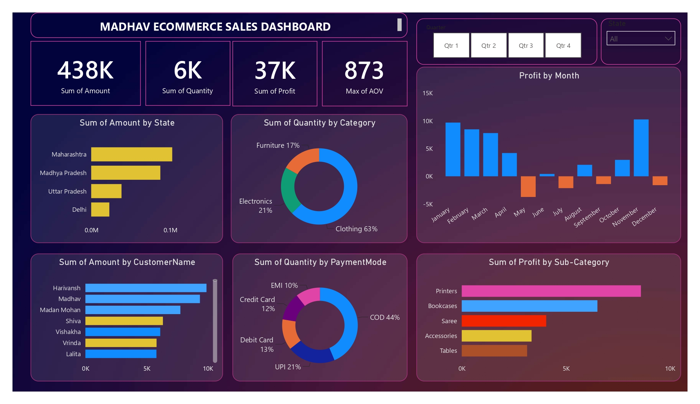

# 📊 Madhav Ecommerce Sales Dashboard

## 📌 Project Overview

The **Madhav Ecommerce Sales Dashboard** is an interactive **Power BI dashboard** designed to analyze and visualize ecommerce sales performance. It provides a clear overview of sales amount, quantity, profit, customers, payment methods, product categories, sub-categories, and state-wise performance.

The dashboard helps users understand business performance through interactive charts, KPI cards, and filters.

## 🎯 Project Objective

The main objective of this project is to create an interactive dashboard that helps analyze ecommerce sales data and identify important business insights such as:

* Overall sales performance
* Total quantity sold
* Total profit generated
* Average Order Value (AOV)
* State-wise sales performance
* Category-wise quantity distribution
* Monthly profit trends
* Customer-wise sales
* Payment mode preferences
* Sub-category-wise profit

## 📊 Dashboard KPIs

The dashboard displays the following key performance indicators:

* **Sum of Amount:** 438K
* **Sum of Quantity:** 6K
* **Sum of Profit:** 37K
* **Max of AOV:** 873

These KPIs provide a quick summary of the overall ecommerce business performance.

## 📈 Dashboard Visualizations

### 1. Sum of Amount by State

A bar chart showing sales amount across different states.

States displayed include:

* Maharashtra
* Madhya Pradesh
* Uttar Pradesh
* Delhi

This visualization helps compare sales performance between different states.

### 2. Sum of Quantity by Category

A donut chart representing the quantity distribution across product categories:

* Clothing – 63%
* Electronics – 21%
* Furniture – 17%

This helps identify which product category contributes the most to the total quantity sold.

### 3. Profit by Month

A column chart showing the monthly profit trend from **January to December**.

It helps identify profitable and less-profitable months and provides an overview of how profit changes throughout the year.

### 4. Sum of Amount by Customer Name

A horizontal bar chart showing sales amount generated by individual customers.

Customers displayed include:

* Harivansh
* Madhav
* Madan Mohan
* Shiva
* Vishakha
* Vrinda
* Lalita

This visualization helps identify customers contributing significantly to sales.

### 5. Sum of Quantity by Payment Mode

A donut chart showing the distribution of orders/quantity based on payment methods:

* COD – 44%
* UPI – 21%
* Debit Card – 13%
* Credit Card – 12%
* EMI – 10%

This helps understand customer payment preferences.

### 6. Sum of Profit by Sub-Category

A horizontal bar chart showing profit generated by different product sub-categories:

* Printers
* Bookcases
* Saree
* Accessories
* Tables

This visualization helps identify the most profitable product sub-categories.

## 🎛️ Interactive Filters

The dashboard includes interactive filters/slicers that allow users to analyze the data dynamically.

### Quarter Filter

Users can filter the dashboard by:

* Qtr 1
* Qtr 2
* Qtr 3
* Qtr 4

### State Filter

Users can also filter the dashboard based on individual states.

These filters make the dashboard interactive and allow users to perform more focused analysis.

## 🛠️ Tools & Technologies

* **Power BI** – Dashboard creation and data visualization
* **Microsoft Excel** – Data source/data preparation
* **DAX** – Calculations and measures
* **Power Query** – Data cleaning and transformation

## 🎨 Dashboard Design

The dashboard uses a dark purple theme with contrasting colors for charts and KPI cards.

The design focuses on:

* Clean layout
* Easy navigation
* Interactive filtering
* KPI-based analysis
* Business-friendly visualizations
* Quick understanding of sales performance

## 📷 Dashboard Preview

## 💡 Key Insights

From the dashboard, we can observe that:

* Clothing contributes the highest quantity share among the available categories.
* COD is the most commonly used payment mode.
* Maharashtra has the highest sales amount among the displayed states.
* Printers generate the highest profit among the displayed sub-categories.
* Monthly profit varies significantly throughout the year.

## 🚀 Learning Outcomes

Through this project, I learned how to:

* Create interactive dashboards in Power BI
* Use different types of charts and visualizations
* Create KPI cards
* Work with slicers and filters
* Analyze ecommerce sales data
* Use DAX measures
* Transform and prepare data using Power Query
* Design a professional business dashboard

## 👨‍💻 Project

**Project Name:** Madhav Ecommerce Sales Dashboard
**Tool:** Microsoft Power BI
**Project Type:** Data Analytics & Data Visualization
**Dashboard:** Ecommerce Sales Analysis

---

⭐ If you find this project useful, feel free to explore the repository and give it a star!
